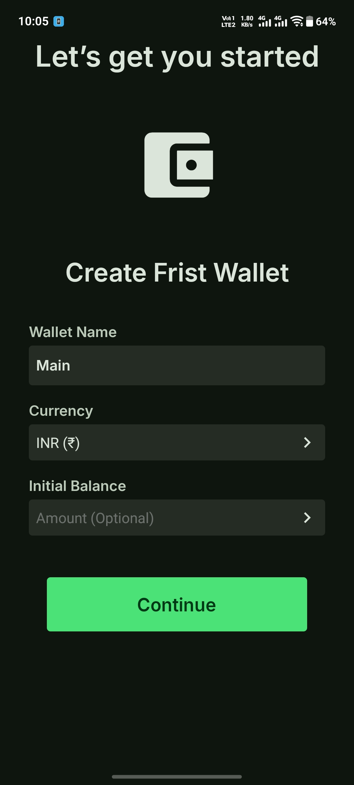
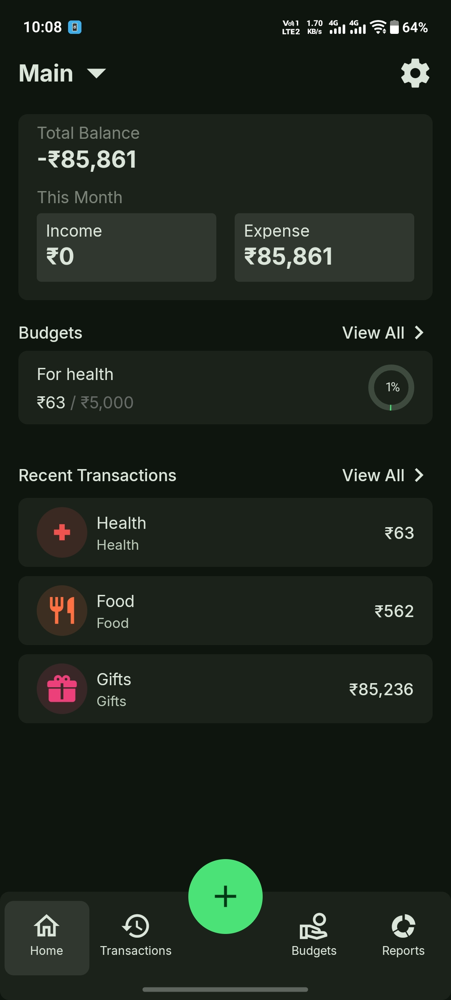
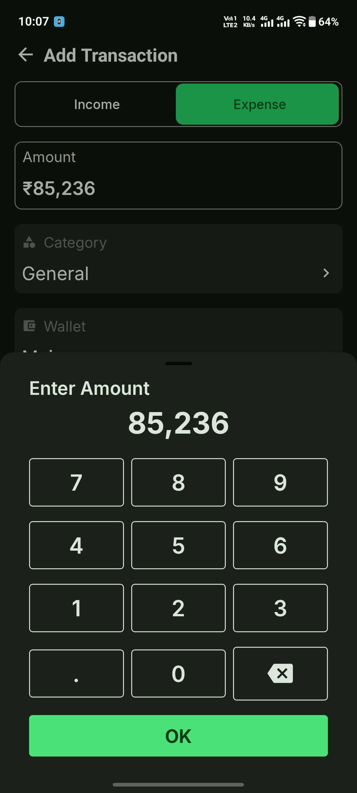

## ExpenseManager

A modern, user-friendly expense management mobile app built with React Native, designed to help users track their finances with ease and efficiency.

## Overview

ExpenseManager is a mobile application that allows users to manage their accounts and track expenses. The app features a clean, intuitive interface with dark/light theme support and internationalization capabilities.

## Screenshots

## Features

- **Profile Management**: Create and manage multiple accounts with initial balances
- **Initial Setup Flow**: Guided initial process for first-time users
- **Theme Support**: Automatic dark/light theme switching based on system preferences
- **Internationalization**: Multi-language support with i18next
- **Persistent Storage**: Data persistence using OP-sqlite for fast, secure local storage
- **Modern UI**: Clean Material Design 3 interface with intuitive UX.
- **Backup and Import (WIP)**: Export and import data and keep the data in your device. Data never leaves your device.

## Contributing

1. Fork the repository
2. Create a feature branch: `git checkout -b feature/my-new-feature`
3. Commit your changes: `git commit -am 'Add some feature'`
4. Push to the branch: `git push origin feature/my-new-feature`
5. Submit a pull request

## License

This project is licensed under the MIT License - see the LICENSE file for details.

Built with ❤️ using React Native and TypeScript
